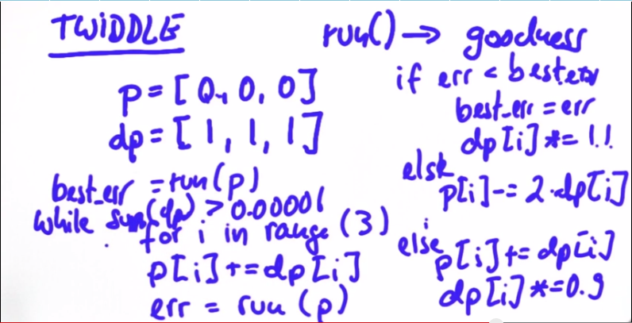
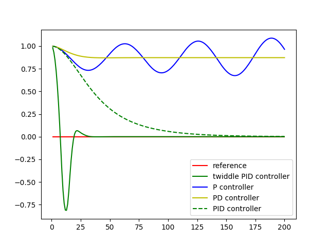

# PID Controller Project
[](http://www.udacity.com/drive)

This project implements a PID (Proportional Integral Derivative) controller to use with the Udacity car simulator.  With the PID running, the car will autonomously drive around the track, adjusting the steering based on a given CTE (Cross Track Error) value.


## Dependencies

* cmake >= 3.5
 * All OSes: [click here for installation instructions](https://cmake.org/install/)
* make >= 4.1
  * Linux: make is installed by default on most Linux distros
  * Mac: [install Xcode command line tools to get make](https://developer.apple.com/xcode/features/)
  * Windows: [Click here for installation instructions](http://gnuwin32.sourceforge.net/packages/make.htm)
* gcc/g++ >= 5.4
  * Linux: gcc / g++ is installed by default on most Linux distros
  * Mac: same deal as make - [install Xcode command line tools]((https://developer.apple.com/xcode/features/)
  * Windows: recommend using [MinGW](http://www.mingw.org/)
* [uWebSockets](https://github.com/uWebSockets/uWebSockets)
  * Run either `./install-mac.sh` or `./install-ubuntu.sh`.
  * If you install from source, checkout to commit `e94b6e1`, i.e.
    ```
    git clone https://github.com/uWebSockets/uWebSockets 
    cd uWebSockets
    git checkout e94b6e1
    ```
    Some function signatures have changed in v0.14.x. See [this PR](https://github.com/udacity/CarND-MPC-Project/pull/3) for more details.
* Simulator. You can download these from the [project intro page](https://github.com/udacity/self-driving-car-sim/releases) in the classroom.

## Basic Build Instructions

1. Clone this repo.
2. Make a build directory: `mkdir build && cd build`
3. Compile: `cmake .. && make`
4. Run it: `./pid`. 

# Project Goals and [Rubric](https://review.udacity.com/#!/rubrics/824/view)

The goals of this project are the following:

* The PID controller must be implemented as was taught in the lessons.
* An implementation of the twiddle algorithm tunes the hyperparameters.
* The vehicle must successfully drive a lap around the track.

# Implementation of the PID controller

Implementing the PID controller was somewhat trivial because it was already done in the [lab.](https://github.com/justinlee007/CarND-PID-Lab/blob/master/src/python/robot.py#L132)  That exercise realized a robot simulator moving around an open area where updates to position were calculated and CTE was used to accurately align the robot to desired position.

In the Udacity car simulator, the CTE value is read from the data message sent by the simulator, and the PID controller updates the error values and predicts the steering angle based on the total error.  This predicted steering angle is a correction of the updated error to the desired setpoint based on proportional, integral, and derivative terms (hence PID).


##### PID Formula

After the PID calculates the steering angle, a throttle value is derived and sent back to the simulator.  Once a new message is received, the new CTE value is used to start the process of update and prediction again.   

The speed at which data messages are sent to the program is highly influenced by the resolution and graphics quality selected in the opening screen of the simulator.  Other factors include speed of the machine running the simulator, the OS and if other programs are competing for CPU/GPU usage.  This is important because I found that if the rate of messages coming into the program were too low, the car would not update fast enough.  It would start oscillating and, eventually, fly off the track.


# Tuning the Hyperparameters

The bulk of the work I did for this project was in tuning the hyperparameters and developing the twiddle algorithm to automatically update them as the car drove around the track.

## Manual Tuning

I started out using some values supplied in the lecture:
```
P (Proportional) = 0.225
I (Integral) = 0.0004
D (Differential) = 4
```

I noticed that changing the integral param *even the slightest* would result in the car wildly oscillating back and forth.  The same would be for the proportional param -- small changes resulting in large oscillations and the car would often go off the track.  The differential value could be changed quite a bit before seeing much change.

## Twiddle Algorithm

After some manual tinkering, I decided to apply the twiddle algorithm to update the parameters automatically.  I structured my implementation of the algorithm to methodically vary each of the parameters and measure the resulting difference in error to determine if increasing or decreasing the value was improving the overall CTE of the car's path.


##### Twiddle Psuedocode

The fundamental concept of twiddle is to refine input parameters based on an empirical feedback mechanism.  The algorithm boils down to:
* Record the error before running
* Change the parameter
* Let the system run
* Record the error again
* Compare the two and chose the one with less error


##### Benefits of a PID controller implementing the twiddle algorithm

Some details of the algorithm are as follows:
### Parameter Deltas

When twiddle runs in the Udacity car simulator, it updates the PID hyperparameters directly, and has an immediate affect on the car's performance.  Because changing the values too much can result in the car immediately flying off the track, I decided to use the seed PID values to drive parameter deltas.  After much tinkering, I decided that the param deltas would initialize to 10% of the seed value.  So even though the twiddle algorithm tunes hyperparameters to a smaller range, it allows for dynamic updates while the simulator is running. 

### Tolerance
Twiddle incorporates a tolerance value as the hyperparameters are tuned, so the algorithm will know when it's finished.  After some tinkering, I ended up keeping the same 0.2 value as used in the lab.

### Result
After much tinkering, my implementation runs well enough to get to 67 MPH and stays on the track.

[Link to project video](https://youtu.be/qMOD0XqE0XQ)

# Lessons Learned

The twiddle logic requires the system to run and accumulate CTE to proceed to the next statement, so I had to record state information to reflect that.  A better approach would be to use a callback mechanism to initiate an accumulation/running timespan  

